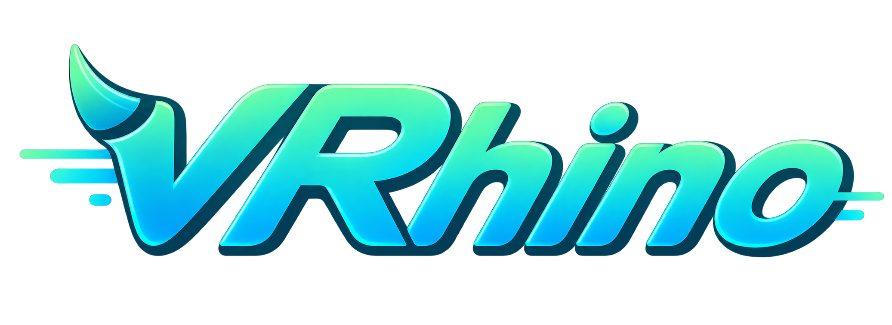

<p align="center">
  
</p>

# VRhino

**Native runtime for local AI video models.**

English | [简体中文](README.zh-CN.md)

VRhino is a self-contained native runtime and model packaging system for
running AI video models locally without model-specific Python environments.

## What is VRhino?

VRhino explores a GGUF + llama.cpp-like distribution and runtime model for AI
video generation. It converts supported checkpoints into `.vrm` packages and
runs them through a shared native runtime.

```text
Model / Checkpoint
        ↓
VRhino conversion
        ↓
      .vrm
        ↓
Shared Native Runtime
        ↓
     Backend
```

The project is still an Alpha. Its model coverage and maturity are not
comparable to llama.cpp today.

## Release status

The source version is **v0.8.0-alpha, unreleased**: the first Windows-supporting
release line. The latest published release remains
[v0.7.0-alpha](https://github.com/pixelrhino-ai/vrhino/releases/tag/v0.7.0-alpha),
an immutable Linux x86_64 CUDA release; its assets and support scope do not change.

The Windows qualification baseline is Windows 10 Pro 22H2 / build 19045,
RTX 3090 24 GiB and NVIDIA driver 610.47. Frozen rc6 completed clean-host Wan
and LTX qualification; it retains its v0.7 build identity as historical
evidence and is not a v0.8 download. A fresh post-merge rc7 must qualify Wan,
LTX, MuseTalk and LatentSync before Windows release publication.

Mochi retains its historical Linux scope. Its frozen admission requires at
least 80 GiB available device memory, so it is not part of the 24 GiB Windows
qualification; this is not a failed model test. No universal Windows/GPU or
macOS support is claimed. See the exact
[v0.8 support matrix and pending gates](docs/release/v0.8.0-alpha.md).

The self-contained product requires a compatible NVIDIA GPU and driver,
sufficient memory/disk space, and network access for uncached model sources.
End users do **not** install CUDA Toolkit, standalone cuDNN, Visual Studio,
Build Tools, CMake, Ninja, Python, PyTorch, Diffusers, Transformers, Conda,
system FFmpeg, MSYS2/MinGW or WSL. Developer build requirements are separate.

The **v0.6.0-alpha** release adds machine-readable Product contracts and a
local Native API for desktop, native, local-daemon, CLI-adjacent, and other
community integrations.

The exact v0.6.0-alpha Public model set is:

- `vrhino/ltx-video-v0.9.1:1.1.1`
- `vrhino/wan2.1-t2v-1.3b:1.0.1`
- `vrhino/mochi-1-preview:1.0.1`
- `vrhino/musetalk-v1.5:1.0.1`
- `vrhino/latentsync-1.6:1.0.1`

## Install

Use the [installation guide](docs/install.md) for the existing v0.7 Linux
download and the planned Windows ZIP layout. **No v0.8 rc7 download has been
published by this preparation change.** Never rename rc6 to v0.8 or add it to
the historical v0.7 release.

Keep the entire package directory intact. Windows packages place `vrhino.exe`,
the bundled media helper and 39 runtime DLLs together; no system FFmpeg or
manual CUDA library search path is needed. Verify the downloaded archive's
published SHA256 and run `--version`, `device` and `doctor` from that package.

## CLI examples

The model package identities introduced in v0.6.0-alpha remain unchanged.
Platform qualification is tracked separately in the v0.8 support matrix:

- `vrhino/ltx-video-v0.9.1:1.1.1`
- `vrhino/wan2.1-t2v-1.3b:1.0.1`
- `vrhino/mochi-1-preview:1.0.1`
- `vrhino/musetalk-v1.5:1.0.1`
- `vrhino/latentsync-1.6:1.0.1`

The following examples use a Linux shell and an installed qualified package.
For Windows PowerShell command syntax, see [installation](docs/install.md).
Pull one exact model package, for example:

```bash
vrhino pull vrhino/ltx-video-v0.9.1:1.1.1
```

Then generate a video:

```bash
vrhino run vrhino/ltx-video-v0.9.1:1.1.1 \
  --prompt "a cat walking in snow" \
  --output output.mp4
```

MuseTalk uses typed video/audio inputs instead of a prompt:

```bash
vrhino pull vrhino/musetalk-v1.5:1.0.1
vrhino run vrhino/musetalk-v1.5:1.0.1 \
  --video input.mp4 \
  --audio driving.wav \
  --output output.mp4
```

The v0.6.0-alpha release includes Public Mode-C support for:

- `vrhino/latentsync-1.6:1.0.1` (`lip_sync`)

LatentSync uses the same typed video/audio CLI shape. It downloads 12 exact
upstream inference assets and converts them locally; Pixel Rhino ships no model
weights or converted VRMs.

The first pull downloads the original artifacts from the model's fixed
upstream revision, converts them locally, and installs the runnable package in
the local VRhino cache. The source acquisition is about 24.77 GB for LTX,
16.36 GiB for Wan, 37.28 GiB for Mochi, and 4.01 GiB for MuseTalk. The release
archive itself contains no model weights or converted model components.

`vrhino pull` prefers the official Hugging Face endpoint and may transparently
fall back to a third-party mirror when the official endpoint is unavailable.

For a concise, privacy-safe local support report, run `vrhino doctor` or
`vrhino doctor MODEL`. It performs no telemetry upload or automatic network
diagnostic request.

Model and cache data defaults to `~/.vrhino`. To use a larger filesystem, set
`VRHINO_HOME` before pulling, for example:

```bash
export VRHINO_HOME=/mnt/large-disk/vrhino
vrhino pull vrhino/ltx-video-v0.9.1:1.1.1
```

This does not change the VRhino binary installation directory. After a
successful verified installation, pull reclaims source-only data that is no
longer needed while preserving installed and shared CAS data.

## How it works

`vrhino pull` downloads a fixed upstream model revision, verifies and caches
the source artifacts, converts them natively into the VRhino model format, and
installs an immutable local package. `vrhino run` executes that package with
the shared native runtime and writes an MP4 using the bundled media component.

Successor packages declare their typed inputs, parameters, defaults, and
outputs through
[ProductInputSchema v1](docs/product/product-input-schema-v1.md). Inspect the
same contract without parsing CLI text:

```bash
vrhino info vrhino/ltx-video-v0.9.1:1.1.1 --json
```

The primary executable also serves the local Native API introduced in v0.6.0-alpha:

```bash
vrhino serve
# Equivalent explicit form:
vrhino serve --host 127.0.0.1 --port 11435
```

The server is part of the primary `vrhino` executable; there is no separate
server package and no Python or Node server dependency. Native API v1 alpha is
a **local API**: it binds to `127.0.0.1:11435` by default, has no
authentication, TLS, or CORS, and is not intended for direct exposure to the
untrusted Internet. Explicit non-loopback binding emits a warning. See the
[Native API v1 contract](docs/api/native-api-v1.md) for the complete seven-route
contract and local absolute-path media rules.

## Documentation

- [Installation and system requirements](docs/install.md)
- [v0.8 release preparation and qualification scope](docs/release/v0.8.0-alpha.md)
- [Model commands](docs/cli/model-cli-v0.md)
- [ProductInputSchema v1](docs/product/product-input-schema-v1.md)
- [Model-info JSON v1](docs/product/model-info-json-v1.md)
- [Native API v1 alpha](docs/api/native-api-v1.md)
- [v0.6.0-alpha build-source provenance boundary](docs/release/build-source-provenance.md)
- [`pull` command](docs/cli/pull-v0.md)
- [`run` command](docs/cli/run-v0.md)
- [`doctor` diagnostics](docs/cli/doctor-v0.md)
- [LTX-Video v0.9.1 source and license notice](docs/models/ltx-video-v0.9.1.md)
- [Wan2.1 T2V 1.3B source and license notice](docs/models/wan2.1-t2v-1.3b.md)
- [Mochi 1 Preview source and license notice](docs/models/mochi-1-preview.md)
- [MuseTalk v1.5 source, use and license notice](docs/models/musetalk-v1.5.md)
- [LatentSync 1.6 source, use and license notice](docs/models/latentsync-1.6.md)
- [VRM format specification](spec/vrm-v0.1.md)
- [Runnable model package specification](spec/model-package-v0.md)

## Alpha limitations

Historical Linux qualification and the pending v0.8 Windows qualification
are distinct. Four Windows product paths must pass on exact rc7 bytes before
publication. Interfaces and compatibility may change during Alpha; no claim
covers every NVIDIA GPU, Windows/Linux version, model checkpoint or architecture.
macOS support is not claimed.

For MuseTalk and LatentSync, technical execution and complete media validation
are separate from manual visual sanity and objective lip-sync quality. A
calibrated objective quality gate remains deferred; no objective quality PASS
is claimed and its deferral is not a Windows-only technical blocker.

See [Alpha limitations](docs/alpha-limitations.md) for details.

## Build from source

Public main contains the production source, Shared Runtime, NeuralGraph, backends, converters and native Product/API implementation. See [source build and tests](docs/source-build.md), [architecture](docs/architecture.md), [packaging](docs/source-packaging.md) and [contribution guide](CONTRIBUTING.md). Source presence does not expand historical release support; HunyuanVideo and the CogVideoX canary are not added to the v0.6 supported-model list.

## License

VRhino project-owned source is available under [Apache-2.0](LICENSE).
Third-party components retain their respective licenses; see
[third-party source notices](THIRD_PARTY_NOTICES.md). Existing released binaries
retain their distributed [Alpha Binary License](licenses/VRHINO-BINARY-LICENSE.txt).

Model licenses are independent. VRhino grants no rights to model weights,
inputs, outputs, or other third-party content.

For MuseTalk, Pixel Rhino distributes no model weights: users acquire the
fixed upstream models and convert them locally. Use remains subject to each
upstream license, including MuseTalk's CreativeML OpenRAIL-M use-based
restrictions. Users are responsible for lawful and consented input media. No
upstream endorsement is implied.

The LatentSync Public package follows the same no-weight Mode-C
boundary. LatentSync model use remains subject to the CreativeML Open RAIL++-M
License and its Attachment A use-based restrictions.
