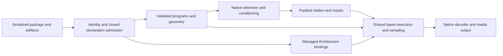

# LTX 0.9.1 Schema2 Native Product

This source candidate adds the second independent DiT/Flow architecture family to
Schema2. It reuses Native conditioning, execution, sampling, decoding and Product
resource lifetimes. It does not change any published package, release or numerical
qualification. The converter emits a separate `review/ltx-video-v0.9.1-schema2:0.1.0`
package with `alpha_unqualified` eligibility. That identity is a local qualification
fixture, not a published registry entry.

## Closed contracts and owners

| Boundary | Declaration and responsibility |
| --- | --- |
| Generic program admission | `vrhino.programs.v2`, exactly `execution.per_step.v1` and `sampling.flow_euler_cfg.v1`; validates instance references and complete typed schedule before execution |
| Shared SamplingRuntime | Flow prediction + FlowEuler solver + FlowSigma schedule; invokes existing CFG/Euler primitives with no history or scheduler |
| Architecture lowering | `vrhino.architecture.ltx_token_flow.v1`, topology `ltx_rms_self_masked_cross_ffn.v1`; fixed hidden 2048, 28 blocks, 32 heads, FFN 8192, latent channels 128 and 715 parameter slots |
| Architecture decoder | Existing LTX decoder, admitted 297 roles, BLC to BCTHW transformation and exact output shape |
| Generic Product geometry | `token_grid_thw.v1`; checked output/grid/token/coordinate/resource contracts before allocation; no expression interpreter |
| Generic Product conditioning | Native SentencePiece, strict indexed Safetensors shards, padded hidden and Bool validity masks for both CFG branches |
| Backend / CUDA / PrecisionPolicy | No source or semantic change; no model identity or precision exception |

The complete normalization, fractional RoPE, modulation, conditioning and output
semantics are frozen by `ltx_declaration.cpp` and the existing LTX forward code.
Unknown topology fields, dimension changes, operator lists and missing/extra or
incorrectly typed parameter roles are rejected. Wan canonical parsing is separate.
Architecture instances retain managed mapping owners; they cannot create a legacy
singleton denoiser. Architecture setup binds seed, shape and resources, and never
constructs a schedule.

## Sampling and authority

The programs artifact is verified for size and SHA256 from the exact bytes parsed,
then compared with the immutable VRM-embedded declaration. Admission converts each
serialized sigma to F32 once, creates a dense, nonquantized CPU `F32[1,1]` timestep
from that value and verifies bit identity. F32 round-trip is checked against the
frozen Legacy 3-step and 40-step tables. Evidence records timestep dtype, shape,
value and bits; it does not pass F32 through the old I64 trace.

There must be 2–1000 transitions, order one, no competing legacy arrays, and CFG
predictions must be `[unconditional, conditional]`. Sigmas start at one, decrease
strictly, remain in [0,1], chain exactly in F32 and end at positive zero. Guidance
must be finite and nonnegative. The mathematical update is
`x_next = x - (sigma - next_sigma) * (u + guidance * (c - u))`.
Implementation preserves the existing numerical order: `cfg_combine(u,c,g)`, F32
`sigma - next_sigma`, then `euler_update(x,guided,delta,true)`. The primitive retains
its existing sign, multiply and add order and scalar precision roles. Expressions
are not reassociated. No `flow_to_x0`, multistep state or Legacy fallback is used.
Execution stops after the admitted final transition; cancellation uses the shared
cleanup mechanism and cannot silently complete a shortened Product run.



`programs.v1` remains the original Flow multistep/I64 contract. The new capability
is required explicitly; a reader supporting only v1 must reject v2, rather than
reinterpret it. Package admission accepts exactly one sampling capability set.
Neither mixed capabilities nor a new declaration advertised as v1 is accepted.
Schema1 factory and execution behavior remain available only through the original
Schema1 path. Explicit Legacy invocations in comparison tests are reference oracles.

## Geometry and resources

For output W/H/F, W and H are positive multiples of 32, F is positive and
`(F-1)%8 == 0`. Grid is `[(F-1)/8+1,H/32,W/32]`, L is its checked product,
and flattening is THW with W fastest. Product prepares dense CPU `I64[3]`
`latent_grid`, CPU `F32[1,3,L]` raw coordinates and BLC sampling shape `[1,L,128]`.
The Architecture applies coordinate scales `[0.32,32,32]` once. Decoder output
must be `[1,3,F,H,W]`. Seed bits and decode seed `seed+100` (uint64 wrap) preserve
the existing RNG behavior. The frozen profile is 704×480, 121 frames at 25 FPS,
40 steps and CFG 3. Overrides of steps, guidance, precision or geometry are rejected.

The declared tensor byte bound checks latent, coordinates, video and CPU geometry
preparation. It does not promise a whole-inference GPU memory bound. Native memory
admission and lifetime mechanisms remain responsible for execution resources.

Logical shard filenames resolve to declared artifacts independently of CAS paths.
Every shard is checked for size, SHA256 over its owned read-only mapping, complete
index ownership and contiguous, nonoverlapping payload ranges. All conditioning
tensor references must resolve. Mapping moves retain validation state. Descriptor
size and write/change timestamps are checked after admission and before each
execution phase on Linux and Windows; this detects ordinary backing mutation but
is not a sandbox against a privileged concurrent writer. No model assets are
modified by the execution path. Small request/tokenizer/conditioning resources
are hashed from the exact bounded bytes consumed by request preparation.

Native SentencePiece validates the protobuf and pad/EOS identities. Both branches
produce padded `[1,128,4096]` hidden states and dense Bool `[1,128]` masks. Trimmed
hidden, incorrect mask dtype/shape/content and all-invalid masks are rejected.
Existing HF tokenizer and single-resource conditioning remain unchanged.

## Build and reproducible checks

Use the normal [source build](../source-build.md), with tokenizers enabled. The
public host CTest profile now includes the small contracts, synthetic SentencePiece,
shard/mask/ownership, Wan package admission and request wiring tests. No external
weights, network or Python inference framework is needed.

```sh
cmake -S native -B build -DCMAKE_BUILD_TYPE=Release \
  -DVRHINO_ENABLE_CUDA=OFF -DVRHINO_ENABLE_TOKENIZERS=ON
cmake --build build -j2
ctest --test-dir build -L public --output-on-failure
```

Full topology CUDA and real-model comparison are optional explicit harnesses. The
full synthetic fixture uses about 5.7 GB disk and the actual 715/297-slot topology:

```sh
build/vrhino-ltx-schema2-cuda-tests "$SYNTHETIC_OUTPUT_DIR"
build/vrhino-ltx-schema2-integration-tests "$TEST_OUTPUT_DIR" "$SENTENCEPIECE_MODEL"
build/vrhino-ltx-schema2-convert "$LEGACY_VRM" "$SOURCE_DIR" \
  native/specs/ltx_schema2_v1 "$FRESH_PACKAGE_DIR"
build/vrhino-ltx-schema2-product-tests "$FRESH_PACKAGE_DIR" "$TEST_OUTPUT_DIR" "$PROMPT"
build/vrhino-ltx-schema2-reference-compare "$FRESH_PACKAGE_DIR" "$LEGACY_VRM" \
  "$COMPARISON_OUTPUT_DIR" "$PROMPT"
```

The converter accepts the frozen source-contract identities, copies all 1012
parameter payloads byte for byte and creates new declarations. It writes physical
paths only in the machine-local `local.json`; that file, weights, private media,
builds and qualification archives must stay outside Git. Once the fixture package
is installed through a private test registry's normal `pull`, normal `run` uses its
verified program-backed Product profile. No public package is overwritten.

## Qualification limits

See [consolidation evidence](../protocol/ltx-schema2-stage1d.md) for the source and
binary identities, affected regressions and exact comparison scope. Synthetic
capability, structural admission, real execution, numerical qualification and
release readiness are independent levels. Full MP4/decoded-frame identity and
bitwise comparison of the first two sampling steps do not prove raw decoder float
identity or all 40 intermediate states. Generic BF16 numerical status remains HOLD.
Windows source CI does not establish Windows Product or GPU qualification.
